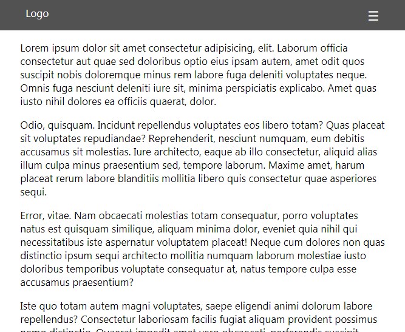
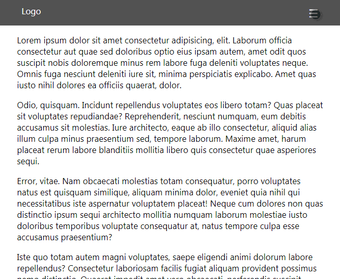

# Simple Off-Canvas Menu with jQuery

There are 2 options - top and right, you just need to change CSS class from `nav right`:

```
div class="menu">
    <div class="nav right">
        ...
    </div>
</div>
```



To `nav top`:

```
div class="menu">
    <div class="nav top">
        ...
    </div>
</div>
```



To `nav overlay`: